# 機器學習入門實作流程練習

---

## 📋 目錄

- [專案簡介](#專案簡介)
- [Step 1. 資料收集與準備](#step-1-資料收集與準備-data-collection--preparation)
- [Step 2. 探索性資料分析（EDA）](#step-2-探索性資料分析-exploratory-data-analysis-eda)
- [Step 3. 資料前處理](#step-3-資料前處理-data-preprocessing)
- [Step 4. 特徵工程](#step-4-特徵工程-feature-engineering)
- [Step 5. 資料拆分與交叉驗證](#step-5-資料拆分與交叉驗證-data-splitting--cross-validation)
- [Step 6. 模型選擇](#step-6-模型選擇-model-selection)
- [Step 7. 模型訓練與優化](#step-7-模型訓練與優化-model-training--optimization)
- [Step 8. 模型測試與評估](#step-8-模型測試與評估-model-testing--evaluation)
- [程式碼](#程式碼)

---

## 專案簡介

| 項目 | 內容 |
|---|---|
| 資料集名稱 | dementia_patients_health_data.csv |
| 資料集來源 | https://www.kaggle.com/code/kapurdhruv/dementia |
| 樣本數 / 欄位數 | （1000,24） |
| 使用工具 | Python（JupyterLab）、pandas |

---

## Step 1. 資料收集與準備 (Data Collection & Preparation)

### 讀取資料集
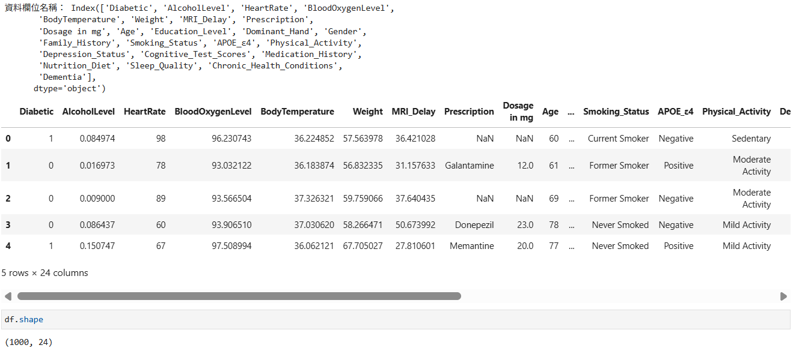

📝 說明：本資料集共 1,000 筆樣本與 24 個特徵欄位，包含臨床生理、基因及生活型態等指標，預測目標為失智症（Dementia）。

---

## Step 2. 探索性資料分析 (Exploratory Data Analysis, EDA)

### 2.1 資料基本結構與型態檢查
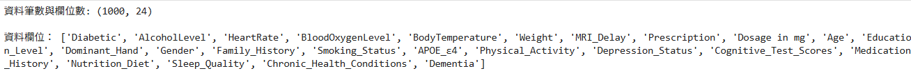

📝 說明：資料包含 1,000 筆樣本與 24 個欄位。型態涵蓋 11 個數值型變項與 13 個類別變項。

### 2.2 缺失值分析
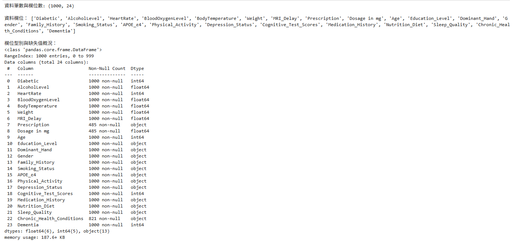
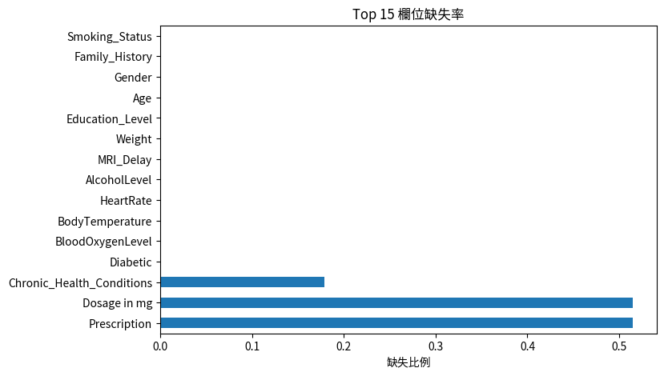

📝 說明：多數欄位無缺失，僅 Prescription 與 Dosage in mg 缺失達 51.5%（對應未用藥者），Chronic_Health_Conditions 缺失 17.9%（對應無慢性病者）。

### 2.3 性別年齡分布
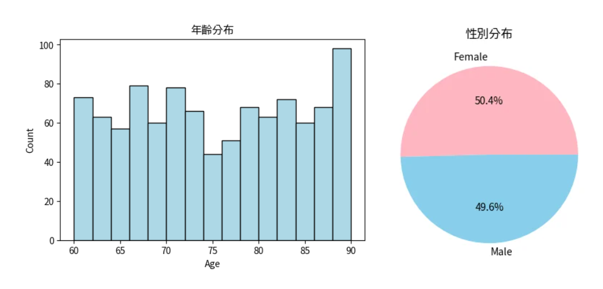

📝 說明：年齡介於 60–90 歲且分佈均勻；性別比例接近 1:1（女性 50.4%、男性 49.6%），樣本分佈平均

### 2.4 臨床風險因子分布
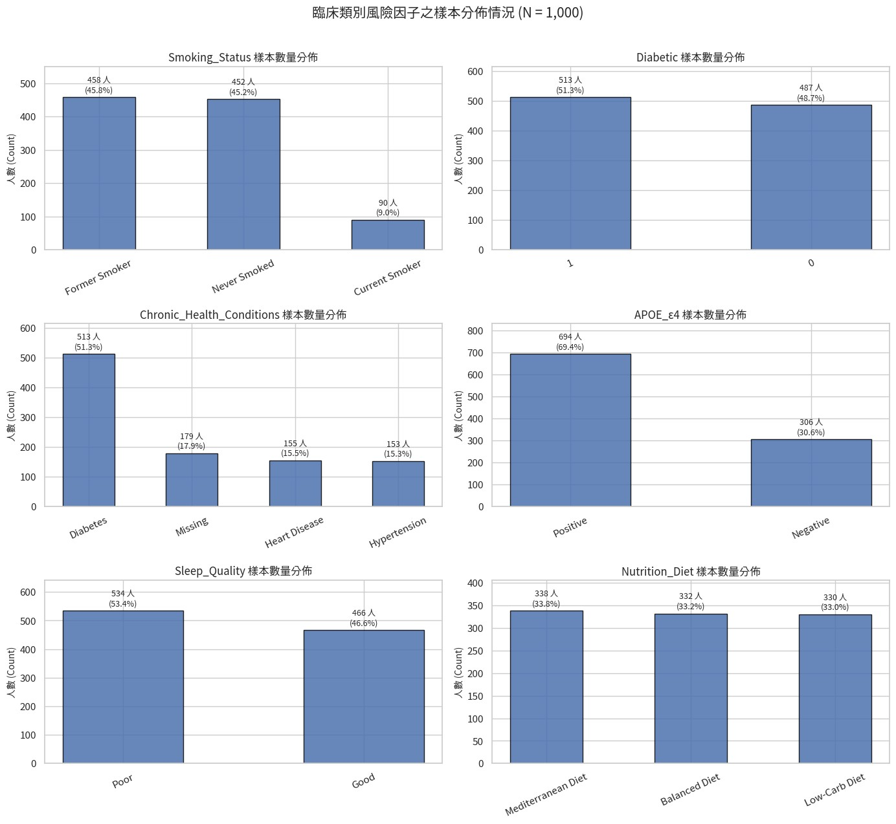
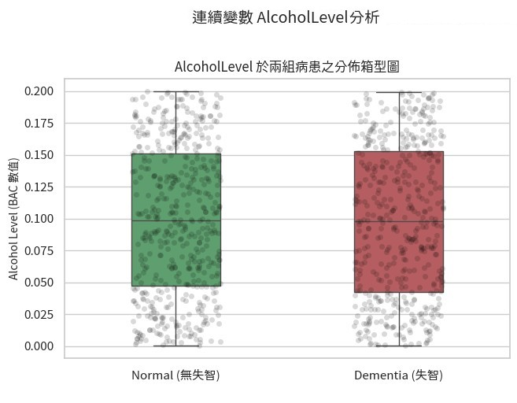
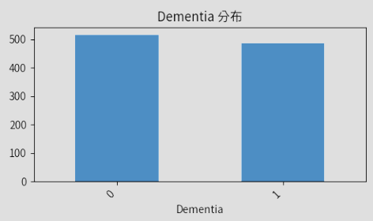

📝 說明：慢性病以糖尿病居多；APOE_ε4 基因陽性過半；有無失智症患者及體內酒精濃度分布均勻。

---

## Step 3. 資料前處理 (Data Preprocessing)

### 3.1 前處理(建立二元與等級變數)及缺失值檢查
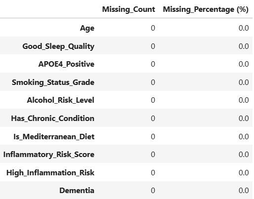

📝 說明：根據研究需求建立將變數轉換（二元/等級化）後，缺失值檢測顯示無缺失資料，缺失率均為 0.0%。

### 3.2 各變項之比例分佈
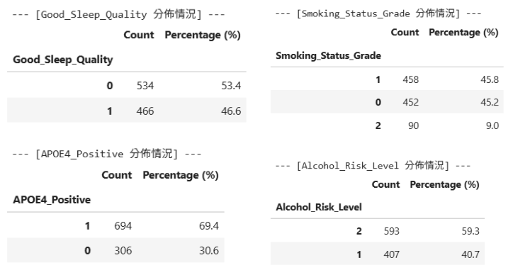
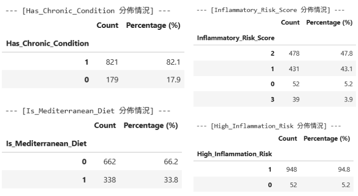

📝 說明：樣本中 82.1% 具慢性病，69.4% 帶有 APOE4 基因；地中海飲食佔 33.8%，良好睡眠佔 46.6%，身體有慢性發炎狀況者達94.8%。

### 3.3 EDA - Correlation Matrix 相關性矩陣
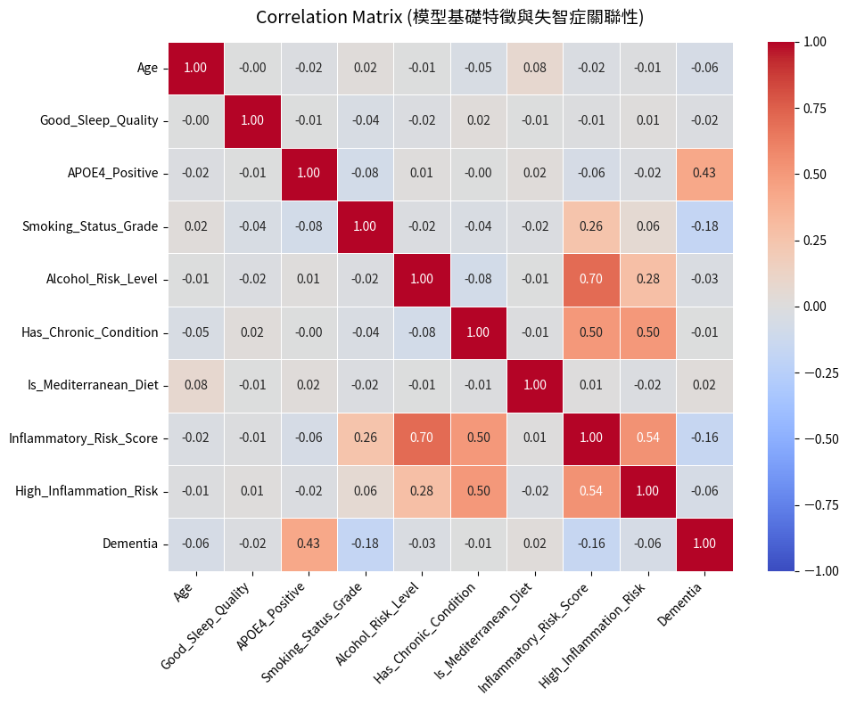

📝 說明：矩陣顯示基因因子 APOE4_Positive 是唯一與失智症呈現顯著中度正相關（*r = 0.43*）的核心變數。

### 3.4 EDA - 二元特徵 Phi 相關係數與卡方檢定
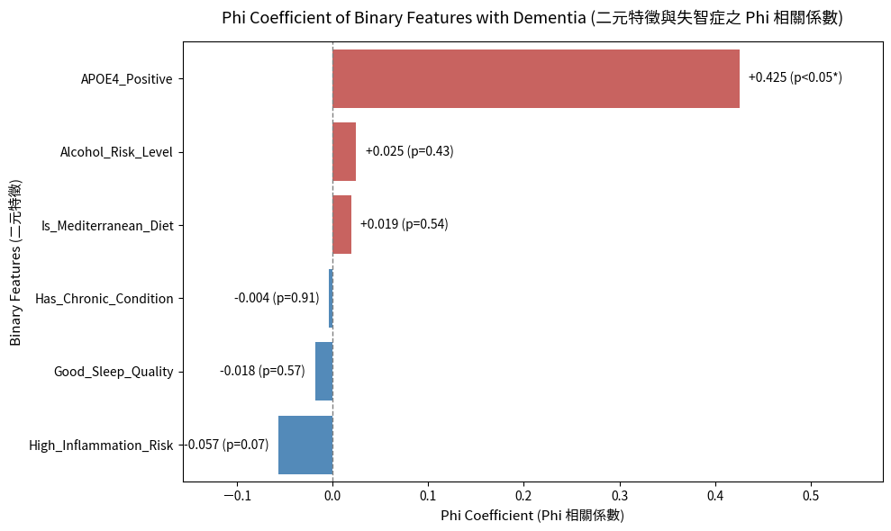

📝 說明：經卡方檢定後，僅有 APOE4_Positive 達到統計顯著（Phi = *+0.425 , p < 0.05*），證實擁有此先天基因缺陷會增加病患得到失智症的風險。相對地，睡眠、飲食及慢性病等單一生活型態變數均未達顯著（*p > 0.05*），說明單一生活因子難以直接決定發病，後續需透過多特徵交互作用來提升預測力。

---

## Step 4. 特徵工程 (Feature Engineering)

### 4.1 預覽建構的特徵工程及缺失值
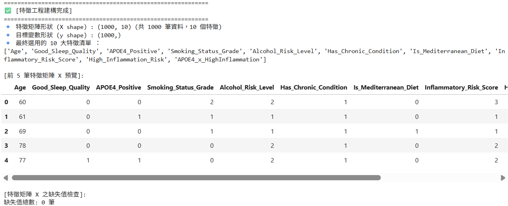

📝 說明：經特徵轉換與交互作用項生成（如 APOE4_x_HighInflammation），最終選用 10 大核心特徵組成特徵矩陣 X（1,000 筆樣本 x 10 個特徵），檢查無缺失值。

### 4.2 建立 PCA 模型與繪圖
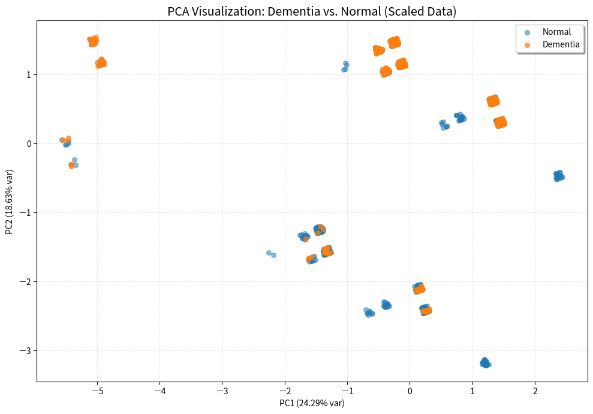
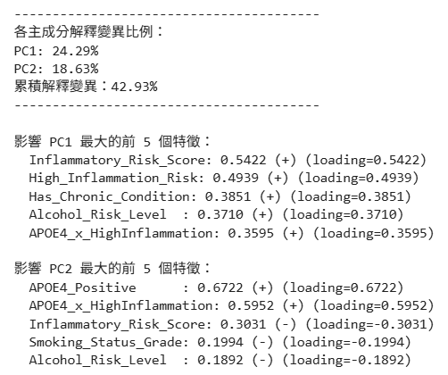

📝 說明：由於特徵多為二元與等級變數，非 PCA 最佳適用的連續型變數，導致累積解釋變異量僅達 42.93%，不過從中可看出PC1的主導特徵為發炎分數，而PC2的主導特徵為 APOE4 基因。

---

## Step 5. 資料拆分與交叉驗證 (Data Splitting & Cross-Validation)

### 5.1 資料切分(訓練集 / 測試集)
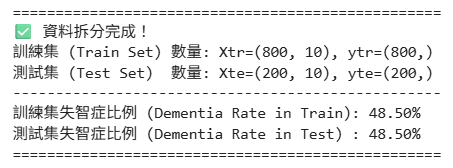

📝 說明：資料已拆分成80%訓練、20%測試，筆數分別為800、200筆，失智症患者比例皆為48.5%。

### 5.2 Oversample
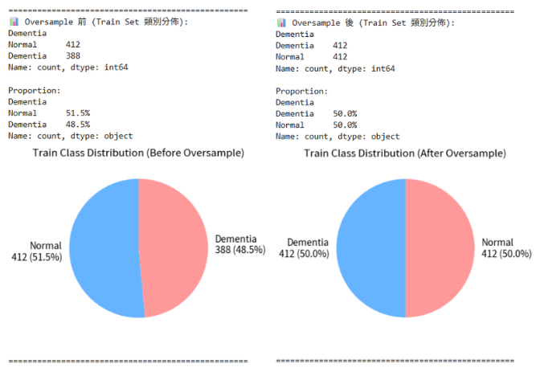

📝 說明：經檢測原始訓練集之失智症患者比例為 48.50%（388 筆 vs. 412 筆），屬於**高度自然平衡之資料集**。不過仍根據標準實作流程進行微幅過採樣（補充 24 筆少數類別至 50.0% : 50.0%）。

### 5.3 交叉驗證設定
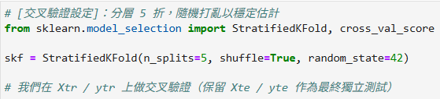

📝 說明：將訓練集分成 5 折輪流驗證。

---

## Step 6. 模型選擇 (Model Selection)

### 模型使用Logistic Regression、Random Forest、Extra Trees、XGBoost、LightGBM、CatBoost

---

## Step 7. 模型訓練與優化 (Model Training & Optimization)

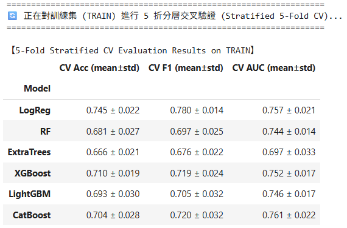

📝 說明：評估結果顯示**羅吉斯迴歸**在準確率（CV Acc = *0.745 ± 0.022*）與 **F1 分數**（CV F1 = *0.780 ± 0.014*）皆居全模型之冠且波動最小，展現極佳的穩定度與分類力；而 **CatBoost**（CV AUC = *0.761 ± 0.022*）則具備最強的風險機率排序能力。

相較之下，隨機森林與 ExtraTrees 等傳統樹模型因預設樹深較深，且本資料集特徵多為離散型態，易對訓練集產生過擬合（Acc 降至 *0.666–0.681*），所以表現不及具正規化機制的 Boosting 模型與羅吉斯迴歸。

✨羅吉斯迴歸能勝出的關鍵，在於本專案特徵多為二元/等級變數，能避免樹狀模型的微觀過度切割。

---

## Step 8. 模型測試與評估 (Model Testing & Evaluation)

### 8.1 混淆矩陣
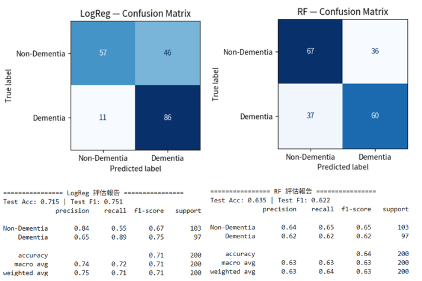
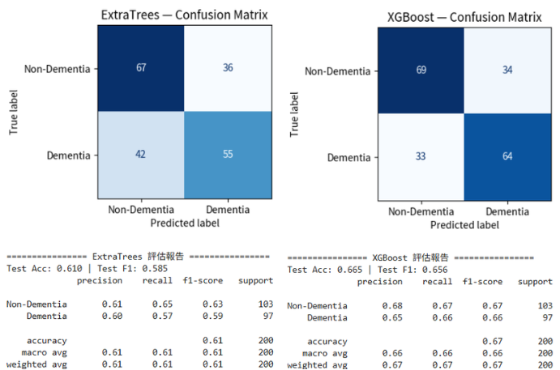
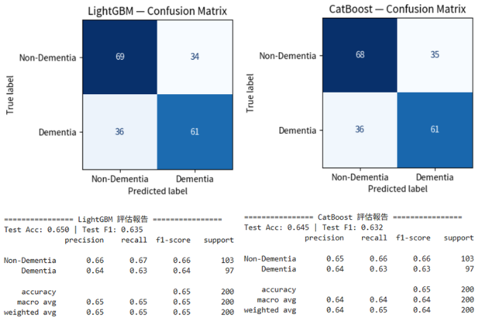

- 最佳模型表現： LogReg 於測試集表現最優，取得最高的準確率（Test Acc = 0.715）與 F1 分數（Test F1 = 0.751）；其對失智症（Dementia）的召回率高達 0.89（僅 11 筆漏判），能有效降低臨床漏診風險。

- 樹模型與 Boost 模型表現： XGBoost（Acc = 0.665, F1 = 0.656）次之，LightGBM（Acc = 0.650）、CatBoost（Acc = 0.645）與隨機森林（Acc = 0.635）表現相近，ExtraTrees（Acc = 0.610）則較為落後。

- 總結： 綜合整體準確率與高召回率特性，LogReg 於獨立測試集中展現最佳的泛化能力與臨床篩檢價值。

### 8.2 ROC 與 AUROC
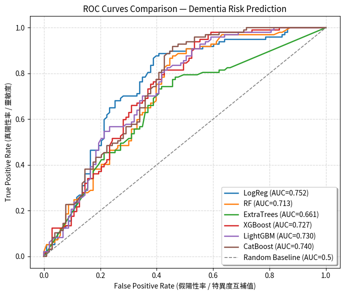

📝 說明：全模型疊加顯示，整體預測能力皆顯著高於隨機猜測，AUROC 落在 $0.661 \sim 0.752$ 區間。其中以 LogReg 表現最佳（AUROC = 0.752），CatBoost（0.740）與 LightGBM（0.730）次之，ExtraTrees（0.661）最為落後；LogReg 的藍色曲線在中高靈敏度區間全程包覆其他模型，代表其全門檻風險排序能力最優。

### 8.3 Precision-Recall Curve 與 AUPRC
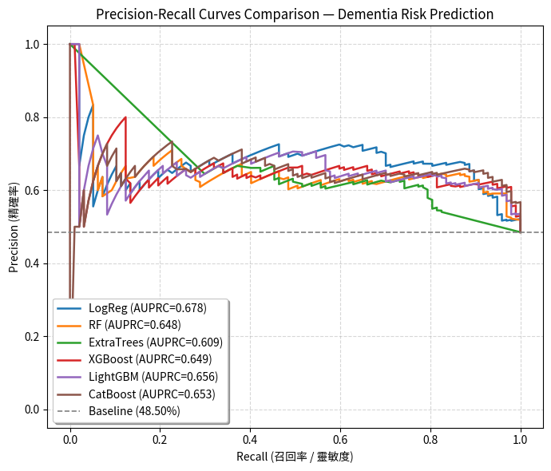

📝 說明：針對失智症的檢測能力，全模型 AUPRC 介於 $0.609 \sim 0.678$ 之間，均遠高於隨機基準線（48.50%）。其中同樣由 LogReg 取得最佳表現（AUPRC = 0.678），代表在維持高召回率（Recall）時，LogReg 能比其餘樹狀模型更穩定地掌控精確率（Precision）。

### 8.4 最佳模型挑選
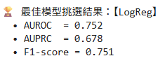

📝 說明：依循 AUROC $\rightarrow$ AUPRC $\rightarrow$ F1-score 的綜合評選機制，最終由 LogReg 獲選為本次專案之最佳預測模型。其關鍵指標為 AUROC = 0.752、AUPRC = 0.678 及 F1-score = 0.751，兼具最佳的泛化表現與臨床實用解釋性。

### 程式碼
[🔗 專案程式碼](https://github.com/zhoonng/ML/blob/main/%E8%87%AA%E5%B7%B1%E7%89%882.0.ipynb)
